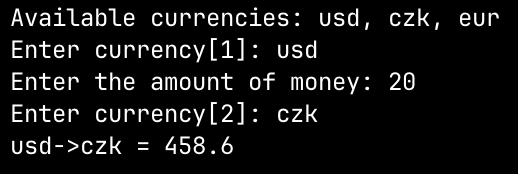

# Currency-Converter

I helped [Adam Konečný](https://github.com/adamkonecny18) with his school Java project, despite my limited experience with Java. It was a learning experience for me, but we managed to make it.

## Requirements

- None
- MakeFile (Optional)

## Compile

### Without Make

```bash
javac Main.java
```

### Make

```bash
make compile
```

## Run

### Without Make

```bash
java Main
```

### Make

```bash
make run
```

## Compile && Run

### Without Make

```bash
javac Main.java && java Main
```

### Make

```bash
make
```

## Example

Here is an example where we convert 20 USD to CZK.


